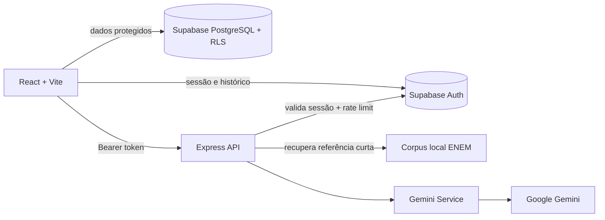

# Minerva ENEM

Plataforma de preparação para o ENEM com simulados, tutor pedagógico e correção de redação assistidos por IA.

O projeto combina React, Express, Supabase e Google Gemini. O backend concentra as chamadas de IA, valida a sessão do estudante e aplica limites de uso; o frontend não contém chaves privadas.

## Funcionalidades

- Dashboard com evolução de estudos.
- Autenticação Supabase: cadastro, login, recuperação e redefinição de senha.
- Simulados por área do conhecimento, com questões, alternativas, gabarito e explicação.
- Tutor ENEM com escopo pedagógico, recusa fora do tema e contexto de conversa mantido no backend.
- Correção de redação pelas competências C1–C5.
- Histórico de simulados e redações com Row Level Security (RLS).
- Interface responsiva com suporte a teclado, landmarks e mensagens acessíveis.

## Arquitetura



O frontend protege as páginas para melhorar a experiência, mas a autorização real das rotas de IA acontece no backend. O Tutor mantém o histórico confiável por usuário no servidor; o navegador envia somente a nova mensagem e o identificador da conversa.

## Stack

| Camada | Tecnologias |
|---|---|
| Frontend | React 19, Vite, Tailwind CSS 4, React Router 7, Recharts, Lucide React, Axios |
| Backend | Node.js 18+, Express 5, `@google/genai`, CORS, Dotenv |
| Dados e autenticação | Supabase Auth, PostgreSQL e RLS |
| IA | Google Gemini com instruções de sistema e respostas JSON |

## Agentes do projeto

- [Minerva](Minerva.md): engenharia, arquitetura, estabilidade e evolução full-stack.
- [Morpheus](Morpheus.md): personas sintéticas, UX, acessibilidade e reteste de regressões.
- [Argos](Argos.md): segurança ofensiva autorizada, com evidências reproduzíveis.

As execuções e correções ficam registradas em [relatorios/](relatorios/).

## Requisitos

- Node.js 18 ou superior.
- Projeto Supabase com Auth habilitado.
- Chave da API do Gemini.

## Configuração local

### 1. Banco de dados

Execute [`supabase_schema.sql`](supabase_schema.sql) no SQL Editor do projeto Supabase. O script cria as tabelas de perfis, simulados e redações, habilita as políticas RLS por usuário e concede os privilégios SQL necessários ao papel `authenticated`. Se as tabelas já existirem, execute também o bloco de `GRANT` ao final do arquivo.

### 2. Backend

```powershell
cd backend
npm install
Copy-Item .env.example .env
```

Preencha `backend/.env`:

```env
PORT=3000
GEMINI_API_KEY=sua_chave_do_gemini
CORS_ORIGIN=http://localhost:5173
SUPABASE_URL=https://seu-projeto.supabase.co
SUPABASE_PUBLISHABLE_KEY=sua_chave_anon_supabase
ENEM_API_BASE_URL=https://api.enem.dev/v1
ENEM_RAG_YEARS=2015,2016,2017,2018,2019,2020,2021,2022,2023
```

Inicie:

```powershell
npm run dev
```

Para carregar o corpus inicial do Tutor e dos simulados, execute uma ingestão versionada antes de iniciar o backend:

```powershell
npm run rag:ingest -- 2015 2016 2017 2018 2019 2020 2021 2022 2023
```

O job respeita o limite da API, grava o cache em `backend/data/enem-rag/` (não versionado) e o Tutor e o gerador de simulados consultam somente referências locais durante a geração. Após uma nova ingestão, reinicie o backend para recarregar o corpus.

Endpoints principais:

| Método | Rota | Finalidade |
|---|---|---|
| GET | `/api/health` | Health check |
| POST | `/api/ai/tutor` | Responder ao Tutor |
| POST | `/api/ai/simulado/gerar` | Gerar questões |
| POST | `/api/ai/redacao/gerar-tema` | Gerar tema |
| POST | `/api/ai/redacao/corrigir` | Corrigir redação |

As rotas `/api/ai/*` exigem `Authorization: Bearer <access_token>` e aplicam limite de chamadas. Nunca coloque `GEMINI_API_KEY` no frontend.

### 3. Frontend

```powershell
cd frontend
npm install
```

Crie `frontend/.env.local`:

```env
VITE_SUPABASE_URL=https://seu-projeto.supabase.co
VITE_SUPABASE_PUBLISHABLE_KEY=sua_chave_anon_supabase
VITE_API_URL=http://localhost:3000/api
```

Inicie:

```powershell
npm run dev
```

Abra o endereço informado pelo Vite, normalmente `http://localhost:5173`.

No Supabase Auth, adicione `http://localhost:5173/redefinir-senha` às Redirect URLs. Em produção, cadastre também a URL equivalente do domínio publicado.

## Validação

No frontend:

```powershell
npm run lint
npm run build
```

No backend:

```powershell
npm start
```

O projeto também possui auditorias documentadas em `relatorios/`, incluindo as rodadas Argos e Morpheus e as correções aplicadas pela Minerva.

## Segurança e limites atuais

- RLS restringe dados ao `auth.uid()` do estudante.
- CORS é configurável por ambiente; ele não é usado como autenticação.
- O limite de IA e o contexto do Tutor estão em memória na configuração atual. Para múltiplas instâncias, migrar esses estados para Redis ou Supabase.
- Testes dinâmicos contra homologação exigem URL, janela e contas de teste autorizadas.
- O Tutor e o gerador de simulados usam RAG lexical inicial com cache local da API enem.dev; a evolução é complementar os anos recentes pelo INEP e migrar para busca híbrida quando houver métricas de qualidade.

## Roadmap de RAG para simulados

Estado atual: o corpus local cobre 2015–2023 e o gerador consulta até duas referências compactas da área antes de criar novas questões. Os itens abaixo são a evolução de qualidade e governança, não pré-requisitos para o fluxo atual.

1. Catalogar habilidades da Matriz ENEM e fontes licenciadas.
2. Criar banco de questões aprovadas, com dificuldade, habilidade, tema e hash.
3. Adicionar cache e exclusão de questões já respondidas.
4. Indexar corpus curado com busca textual + vetorial.
5. Recuperar poucos trechos e gerar somente quando não houver questão adequada.
6. Medir custo, latência, repetição, validade do JSON e qualidade pedagógica.

## Autor

Desenvolvido por Leonardo Furlanetto para um desafio de inovação educacional com IA.
