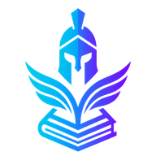
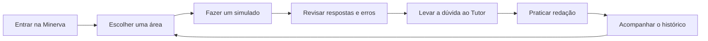
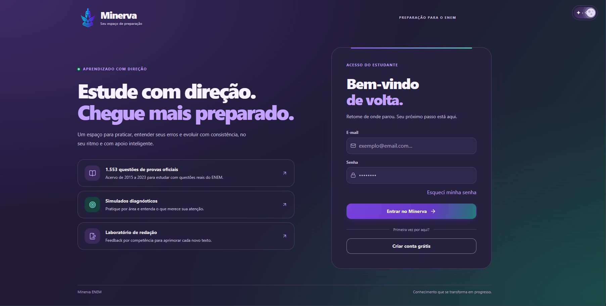
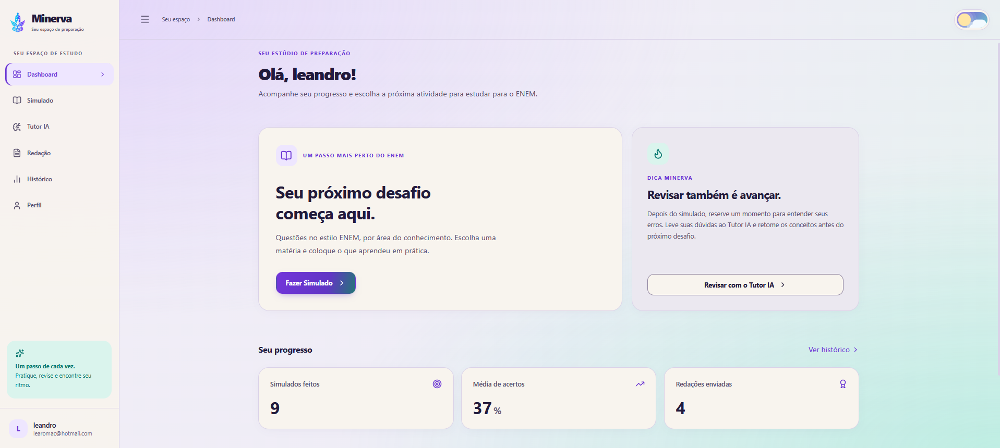
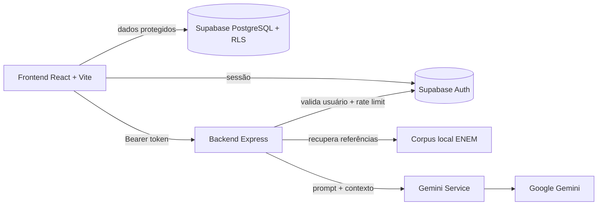

<div align="center">



# Minerva ENEM

### Estude com direção. Pratique com propósito. Evolua com inteligência.

Uma plataforma educacional com IA para quem quer se preparar melhor para o ENEM, entender os próprios erros e construir consistência no estudo.

<p>
  <a href="https://minerva-front.pages.dev">Acessar a demonstração</a>
  ·
  <a href="#-comece-aqui">Começar localmente</a>
  ·
  <a href="#-arquitetura">Conhecer a arquitetura</a>
</p>

<p>
  
  
  
  
</p>

</div>

<p align="center">
  <em>🦉 Conhecimento para orientar. 🛡️ Estratégia para proteger. 📖 Prática para evoluir.</em>
</p>

## ✨ O que é a Minerva?

A Minerva transforma a preparação para o ENEM em um ciclo de estudo mais claro:

```text
Praticar → entender o erro → revisar → tentar novamente → acompanhar a evolução
```

O estudante pode fazer simulados por área, conversar com um Tutor ENEM, treinar redação e acompanhar os resultados em um único ambiente. A IA é usada como apoio pedagógico, com escopo definido, referências recuperadas do corpus de questões e persistência do histórico.

> A Minerva não foi pensada para entregar respostas prontas. Ela foi pensada para ajudar o estudante a construir raciocínio, reconhecer padrões de erro e estudar com mais autonomia.

## 🎯 Por que este projeto importa?

Muitos estudantes não precisam apenas de mais conteúdo. Eles precisam saber **o que estudar agora**, **por que erraram** e **qual deve ser o próximo passo**.

A Minerva responde a esse problema com três experiências centrais:

| Experiência | O que resolve |
|---|---|
| **Simulados diagnósticos** | Permitem praticar por área e identificar o nível atual de desempenho. |
| **Tutor ENEM** | Explica conceitos, raciocínios e distratores em uma conversa pedagógica. |
| **Laboratório de redação** | Avalia as competências C1 a C5 e transforma a nota em diagnóstico. |

## 🚀 Funcionalidades

- **Dashboard de estudo:** visão rápida do progresso e próximos caminhos de prática.
- **Simulados por área:** Linguagens, Ciências Humanas, Ciências da Natureza e Matemática.
- **Questões geradas por IA:** alternativas A-E, gabarito e explicação pedagógica.
- **Tutor ENEM:** conversa focada no ENEM, ensino médio, estratégias de prova e redação.
- **RAG com corpus versionado:** recuperação local de 1.553 questões das edições de 2015 a 2023.
- **Correção de redação:** nota total e análise pelas cinco competências do ENEM.
- **Histórico persistente:** simulados, redações, metas e conversas do Tutor por estudante.
- **Tema de redação por IA:** proposta inédita, eixo temático e contexto motivador.
- **Autenticação completa:** cadastro, login, logout, recuperação e redefinição de senha.
- **Tema claro e escuro:** escolha persistida no navegador, com contraste e foco acessível.
- **Segurança por camadas:** RLS no Supabase, validação no backend, rate limit e Markdown sanitizado.

## 🧭 Uma jornada de estudo completa



Cada etapa alimenta a próxima. O resultado não termina na nota: ele indica uma oportunidade de revisão.

## 🖼️ Demonstração visual

O projeto está disponível em:

> **[minerva-front.pages.dev](https://minerva-front.pages.dev)**

### Primeira impressão

<table>
  <tr>
    <td width="50%" align="center">
      
      <br />
      <sub><strong>Entrada do estudante</strong><br />Identidade visual, acesso e proposta de valor.</sub>
    </td>
    <td width="50%" align="center">
      
      <br />
      <sub><strong>Dashboard de estudo</strong><br />Próximo desafio, progresso e atalhos de prática.</sub>
    </td>
  </tr>
</table>

As principais telas da experiência são:

| Tela | Experiência apresentada |
|---|---|
| Login | Entrada simples, recuperação de acesso e identidade visual da Minerva. |
| Dashboard | Próximo desafio, dica de estudo e visão de progresso. |
| Simulado | Configuração, questões, respostas e revisão pedagógica. |
| Tutor ENEM | Conversa persistente com Markdown, tabelas e fórmulas. |
| Redação | Tema, texto do estudante, nota e feedback por competência. |
| Histórico | Evolução dos simulados e registros de redação. |

> Os prints acima são capturas reais da interface. Novas telas podem ser adicionadas à galeria conforme os fluxos de Simulado, Tutor e Redação forem registrados.

<details>
  <summary><strong>🔎 Ver o fluxo de uma dúvida no Tutor</strong></summary>

  <br />

  ```text
  Pergunta do estudante
          ↓
  Frontend envia o Bearer token
          ↓
  Backend valida sessão e rate limit
          ↓
  RAG recupera referências locais do ENEM
          ↓
  Gemini gera uma explicação pedagógica
          ↓
  Histórico é persistido por estudante
  ```

  O Tutor não depende apenas da memória do navegador: a conversa é persistida no Supabase e restaurada quando o estudante retorna à tela. Durante a recuperação, o estudante pode digitar a pergunta, mas o envio aguarda a conclusão para preservar a ordem da conversa. Se a recuperação falhar, a interface avisa e orienta a verificar a conexão antes de continuar.

</details>

## 🏛️ Arquitetura



### Responsabilidade de cada camada

| Camada | Responsabilidade |
|---|---|
| **React/Vite** | Interface, navegação, estados de carregamento e experiência responsiva. |
| **Supabase Auth** | Cadastro, login, sessões e recuperação de acesso. |
| **Supabase PostgreSQL** | Perfil, simulados, redações e histórico do Tutor. |
| **RLS** | Isolamento dos dados por usuário autenticado. |
| **Express** | API, validação de entrada, autenticação de chamadas de IA e tratamento de erros. |
| **RAG local** | Recuperação lexical de referências do corpus ENEM versionado. |
| **Gemini** | Geração de explicações, questões, temas e correções estruturadas. |

O frontend não contém a chave privada do Gemini. As rotas de IA exigem um Bearer token válido, passam por rate limit e só então chegam aos controllers do backend.

## 🧠 RAG: IA com contexto de questões do ENEM

O Tutor e o gerador de simulados consultam referências antes da geração:

```text
Pergunta ou área
      ↓
Tokenização e busca lexical no corpus local
      ↓
Filtro da área nos simulados e referências curtas e limitadas
      ↓
Prompt do Gemini com contexto de apoio
      ↓
Resposta pedagógica ou questão inédita
```

O corpus atual cobre 2015 a 2023 e possui 1.553 questões:

| Ano | Questões |
|---:|---:|
| 2015 | 181 |
| 2016 | 181 |
| 2017 | 181 |
| 2018 | 181 |
| 2019 | 107 |
| 2020 | 180 |
| 2021 | 181 |
| 2022 | 181 |
| 2023 | 180 |
| **Total** | **1.553** |

A API externa é usada no job de ingestão. Durante a pergunta do estudante, a aplicação consulta os JSON versionados localmente. O Simulado só recebe exemplos da área escolhida, inclusive em “Linguagens e Códigos”; o Tutor ignora termos genéricos como “diferença”, exige mais de um termo em comum e restringe a área quando a pergunta traz pistas claras. Se não houver referência relevante, a geração segue sem contexto do corpus. O RAG melhora o alinhamento com o estilo do ENEM, mas não transforma a IA em uma fonte infalível; as respostas ainda devem ser tratadas como apoio educacional.

O Tutor tenta primeiro o Gemini 3.6 Flash, com Flash-Lite como alternativa. O Simulado prioriza o Gemini 3.5 Flash-Lite, com Flash como alternativa. Antes de entregar um simulado ao frontend, o backend verifica a quantidade de questões, cinco alternativas preenchidas, gabarito e explicação. Isso valida a estrutura, não a correção pedagógica das questões.

## 🛡️ Segurança e privacidade

A Minerva foi estruturada com defesa em camadas:

- **Chave Gemini somente no backend.**
- **Bearer token validado no backend** antes das rotas de IA.
- **Row Level Security** para impedir acesso cruzado aos dados dos estudantes.
- **Validação de `conversationId`** antes de carregar uma conversa do Tutor.
- **Rate limit** para operações de IA e tentativas de autenticação.
- **Limite de tamanho de payload** no Express.
- **CORS configurável por ambiente.**
- **Headers de segurança** no backend.
- **Markdown do Tutor sanitizado**, sem HTML bruto ou scripts.
- **Tratamento de cancelamento**, evitando persistir uma resposta que o estudante interrompeu.

Limitações conhecidas e transparentes:

- A geração de IA pode conter erros e deve ser revisada.
- O RAG atual é lexical, não vetorial.
- O rate limit de IA é local à instância atual.
- A pontuação exibida nos simulados é uma estimativa simplificada, não a TRI oficial.
- O tier gratuito do backend pode introduzir cold start após um período sem tráfego.

## 🧰 Stack tecnológica

| Área | Tecnologias |
|---|---|
| Frontend | React 19, Vite, Tailwind CSS 4, React Router 7, Recharts, Lucide React, Axios |
| Backend | Node.js 18+, Express 5, `@google/genai`, CORS, Dotenv |
| Dados | Supabase Auth, PostgreSQL, REST e Row Level Security |
| IA | Google Gemini, prompts pedagógicos e respostas JSON estruturadas |
| Deploy | Cloudflare Pages para o frontend e Render Web Service para o backend |
| Corpus | JSON versionado de questões ENEM 2015–2023 |

## ⚡ Comece aqui

### Pré-requisitos

- Node.js 18 ou superior.
- Um projeto Supabase com Auth habilitado.
- Uma chave da API do Gemini.

### 1. Banco de dados

Execute [`supabase_schema.sql`](supabase_schema.sql) no SQL Editor do Supabase. O script cria as tabelas de perfil, simulados, redações e histórico persistente do Tutor, além das políticas RLS e grants para o papel `authenticated`.

### 2. Backend

```powershell
cd backend
npm install
Copy-Item .env.example .env
```

Preencha `backend/.env`:

```env
PORT=5000
GEMINI_API_KEY=sua_chave_do_gemini
CORS_ORIGIN=http://localhost:5173
SUPABASE_URL=https://seu-projeto.supabase.co
SUPABASE_PUBLISHABLE_KEY=sua_chave_publicavel_do_supabase
ENEM_API_BASE_URL=https://api.enem.dev/v1
ENEM_RAG_YEARS=2015,2016,2017,2018,2019,2020,2021,2022,2023
```

Para iniciar em desenvolvimento:

```powershell
npm run dev
```

Para gerar ou atualizar o corpus:

```powershell
npm run rag:ingest -- 2015 2016 2017 2018 2019 2020 2021 2022 2023
```

### 3. Frontend

```powershell
cd frontend
npm install
```

Crie `frontend/.env.local`:

```env
VITE_SUPABASE_URL=https://seu-projeto.supabase.co
VITE_SUPABASE_PUBLISHABLE_KEY=sua_chave_publicavel_do_supabase
VITE_API_URL=http://localhost:5000/api
```

Inicie:

```powershell
npm run dev
```

O Vite normalmente disponibiliza a aplicação em `http://localhost:5173`.

No Supabase Auth, adicione `http://localhost:5173/redefinir-senha` às Redirect URLs. Em produção, cadastre também a URL equivalente do domínio publicado.

## 🔌 API principal

| Método | Rota | Finalidade |
|---|---|---|
| GET | `/api/health` | Verificar se a API está online |
| POST | `/api/ai/tutor` | Responder ao Tutor ENEM |
| GET | `/api/ai/tutor/latest` | Restaurar a conversa mais recente |
| DELETE | `/api/ai/tutor/history` | Limpar o histórico do Tutor |
| POST | `/api/ai/simulado/gerar` | Gerar questões por área |
| POST | `/api/ai/redacao/gerar-tema` | Gerar proposta de redação |
| POST | `/api/ai/redacao/corrigir` | Corrigir redação pelas competências |

As rotas `/api/ai/*` exigem `Authorization: Bearer <access_token>`. A chave do Gemini nunca deve ser colocada no frontend.

## ☁️ Deploy

### Cloudflare Pages — frontend

```text
Root directory: frontend
Build command: npm run build
Output directory: dist
```

Variáveis:

```text
VITE_SUPABASE_URL
VITE_SUPABASE_PUBLISHABLE_KEY
VITE_API_URL=https://sua-api.onrender.com/api
```

### Render Web Service — backend

```text
Root directory: backend
Build command: npm ci
Start command: npm start
Health check: /api/health
```

Variáveis:

```text
GEMINI_API_KEY
SUPABASE_URL
SUPABASE_PUBLISHABLE_KEY
CORS_ORIGIN=https://seu-projeto.pages.dev
```

Antes da apresentação, valide o health check, login, Tutor, simulado, redação, histórico e persistência. Se o backend gratuito estiver suspenso, religue-o algumas horas antes da demonstração para absorver o cold start.

## ✅ Validação local

Frontend:

```powershell
cd frontend
npm run lint
npm run build
npm test
```

Backend:

```powershell
cd backend
node --check src/server.js
node --check services/enemRagService.js
node --check services/geminiService.js
npm test
```

As auditorias de experiência e segurança ficam registradas em [`relatorios/`](relatorios/), com rodadas do Morpheus e do Argos e os respectivos handoffs para correção.

## 🗂️ Estrutura do projeto

```text
Minerva/
├── frontend/                 React, páginas, componentes e testes de UI
├── backend/                  Express, controllers, serviços e corpus RAG
├── agents/                   Prompts e responsabilidades dos agentes
├── relatorios/               Evidências auditáveis das rodadas
├── docs/                     Documentação complementar
├── spec.md                   Especificação funcional e técnica
├── supabase_schema.sql       Banco, RLS e grants
└── render.yaml               Configuração do Web Service
```

## 🤖 Governança com três agentes

O desenvolvimento usa uma divisão clara de responsabilidades:

- **Minerva:** engenharia full-stack, arquitetura e implementação.
- **Morpheus:** experiência do estudante, acessibilidade e testes com personas.
- **Argos:** segurança ofensiva autorizada e análise de superfície de ataque.

O ciclo é simples:

```text
Implementar → validar experiência → auditar segurança → corrigir → retestar
```

Os relatórios preservam as evidências e ajudam a transformar observações em backlog técnico.

## 🛣️ Próximas evoluções

- Migrar o rate limit de IA para uma camada distribuída.
- Evoluir o RAG lexical para busca híbrida textual e vetorial.
- Adicionar observabilidade de latência, custo e falhas do Gemini.
- Ampliar a validação estrutural também para os retornos de tema e correção de redação.
- Adicionar exclusão de questões já respondidas e dificuldade adaptativa.
- Expandir a galeria visual com capturas dos fluxos de Simulado, Tutor e Redação.
- Ampliar testes ponta a ponta com contas sintéticas autorizadas.

## 👤 Criador

Desenvolvido por **Leandro Furlanetto** para um desafio de inovação educacional com IA.

<p align="center">
  
  <br />
  <em>Minerva ENEM — conhecimento, estratégia e evolução.</em>
</p>
