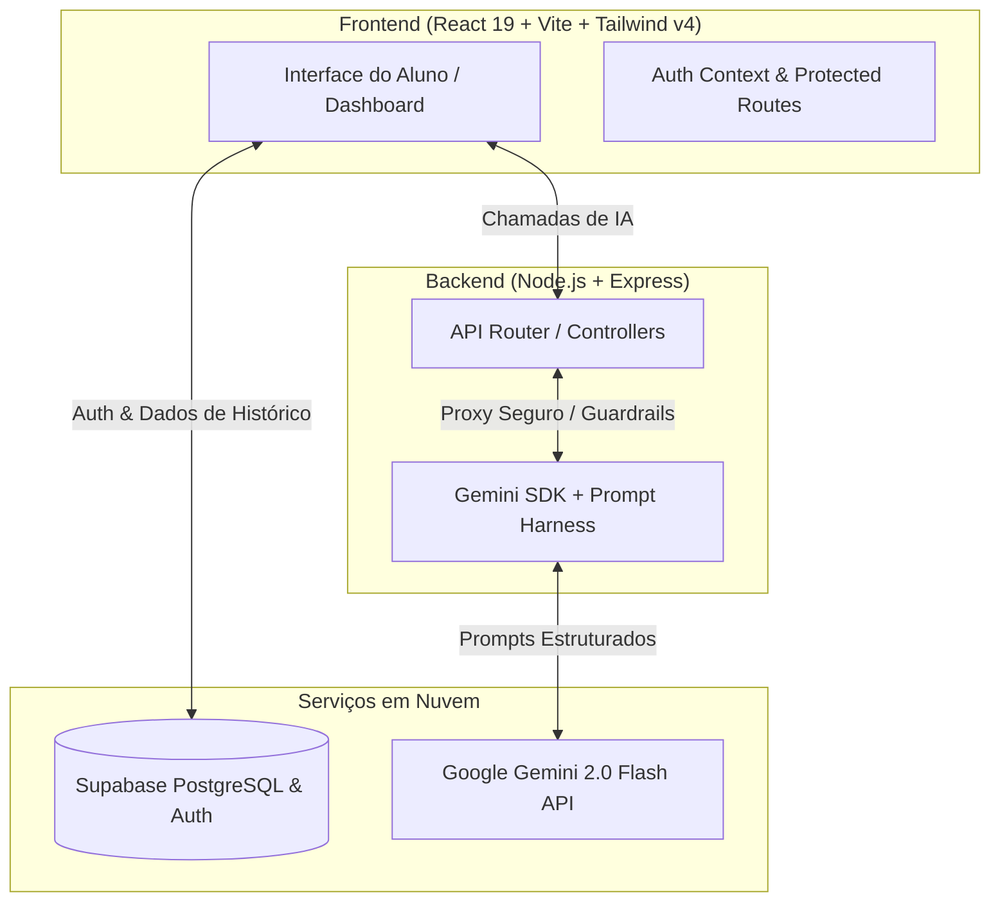

# 🦉 Minerva ENEM — Plataforma Inteligente de Preparação para o ENEM

> Projeto desenvolvido para o desafio de tecnologia educacional integrado com Inteligência Artificial Generativa (**Google Gemini**).

[](https://seu-link-aqui.vercel.app)
[](https://seu-link-aqui.onrender.com)
[](https://react.dev/)
[](https://tailwindcss.com/)
[](https://nodejs.org/)
[](https://ai.google.dev/)
[](https://supabase.com/)

---

## 🔗 Links de Acesso (Deploy)

- 🌐 **Aplicação Web (Frontend):** [https://seu-deploy-minerva.vercel.app](https://seu-deploy-minerva.vercel.app)
- ⚙️ **API REST (Backend):** [https://seu-backend-minerva.onrender.com](https://seu-backend-minerva.onrender.com)

---

## 💡 A Proposta e o Uso da Inteligência Artificial

O **Minerva ENEM** foi projetado para ir além de um chatbot genérico. Criamos uma **camada de governança pedagógica (AI Harness & Guardrails)** alinhada à Matriz de Referência do ENEM:

### 1. 🤖 Tutor ENEM com Guardrail Anti-Alucinação
- **Foco Estrito:** O assistente pedagógico é condicionado por *hard constraints* para responder única e exclusivamente conteúdos do ENEM (Linguagens, Humanas, Natureza, Matemática e Redação).
- **Recusa Ativa e Recomposição:** Qualquer solicitação fora de escopo (esportes, política partidária, código/programação, etc.) é recusada gentilmente e o estudante é redirecionado aos estudos.
- **Didática Socrática:** A IA não apenas entrega a resposta, mas explica a fundamentação teórica, a aplicação no cotidiano e identifica os distratores das alternativas.

### 2. 📝 Gerador Dinâmico de Simulados com TRI
- Geração em tempo real de questões inéditas no formato ENEM por área do conhecimento.
- Saída estritamente estruturada via **JSON Schema Mode** do Gemini, com gabarito comentado e estimativa de pontuação TRI.

### 3. ✍️ Correção de Redação por Competência (C1 a C5)
- Avaliação detalhada de redações nos mesmos critérios da banca examinadora oficial:
  - **C1:** Domínio da norma culta da língua escrita
  - **C2:** Compreensão da proposta temática e repertório sociocultural
  - **C3:** Seleção, relação e interpretação de argumentos
  - **C4:** Demonstração de conhecimento dos mecanismos linguísticos
  - **C5:** Elaboração de proposta de intervenção detalhada (Agente, Ação, Meio, Efeito, Detalhamento)

---

## 🏗️ Arquitetura da Aplicação



---

## 🛠️ Stack Tecnológica

| Camada | Tecnologias |
|---|---|
| **Frontend** | React 19, Vite, Tailwind CSS v4, React Router 7, Recharts, Lucide React, Axios |
| **Backend** | Node.js (ESM), Express 5, `@google/genai` (SDK oficial do Gemini), CORS, Dotenv |
| **Banco de Dados & Auth** | Supabase (PostgreSQL com Row Level Security e Auth integrado) |
| **Inteligência Artificial** | Google Gemini 2.0 Flash com System Instructions & Structured Outputs |

---

## 🚀 Como Rodar o Projeto Localmente

### Pré-requisitos
- **Node.js** (versão 18 ou superior)
- **Conta no Google AI Studio** (para obter sua [Gemini API Key](https://aistudio.google.com/))
- **Projeto no Supabase** (para Auth e PostgreSQL)

---

### 1. Clonar o repositório
```bash
git clone https://github.com/seu-usuario/seu-nome-enem-ai-challenge.git
cd Minerva
```

---

### 2. Configurar o Banco de Dados (Supabase)
1. Acesse o **SQL Editor** do seu projeto no [Supabase](https://supabase.com/).
2. Copie e execute o conteúdo do arquivo [`supabase_schema.sql`](file:///C:/Users/LeoFurlanetto/Projetos/Minerva/supabase_schema.sql).

---

### 3. Configurar e Rodar o Backend
```bash
cd backend
npm install
```

Crie o arquivo `.env` no diretório `backend/`:
```env
PORT=3000
GEMINI_API_KEY=sua_chave_do_gemini_aqui
CORS_ORIGIN=http://localhost:5173
```

Inicie o servidor backend:
```bash
npm run dev
# Servidor rodará em http://localhost:3000
```

---

### 4. Configurar e Rodar o Frontend
Em outro terminal:
```bash
cd frontend
npm install
```

Verifique o arquivo `.env.local` no diretório `frontend/`:
```env
VITE_SUPABASE_URL=https://seu-projeto.supabase.co
VITE_SUPABASE_PUBLISHABLE_KEY=sua_chave_anon_supabase
VITE_API_URL=http://localhost:3000/api
```

Inicie o servidor de desenvolvimento:
```bash
npm run dev
# Acesse http://localhost:5173 no seu navegador
```

---

## ♿ Acessibilidade e Boas Práticas

- **Semântica HTML & ARIA:** Uso de landmarks (`main`, `nav`, `aside`, `role="alert"`, `aria-live` para mensagens do chat).
- **Código Limpo:** Modularização em componentes reutilizáveis, hooks e separação estrita de camadas.
- **Segurança:** Chaves sensíveis protegidas no backend (`.env`), sem exposição de API Keys no bundle do cliente. Políticas de **Row Level Security (RLS)** ativas no banco de dados.

---

## 👥 Autor

Desenvolvido por **Leonardo Furlanetto** para o Desafio de Inovação Educacional com IA.
