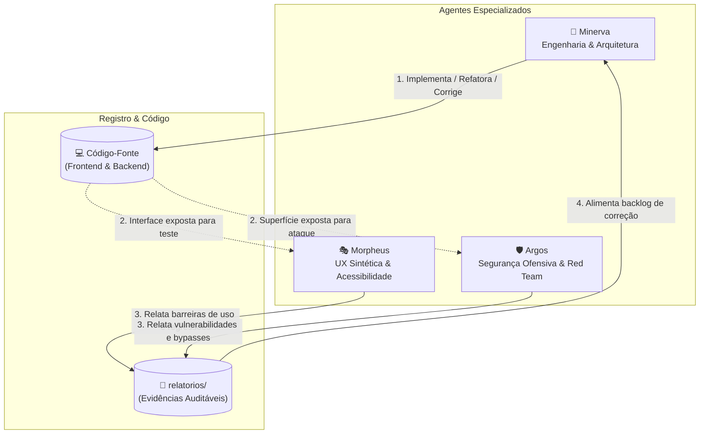
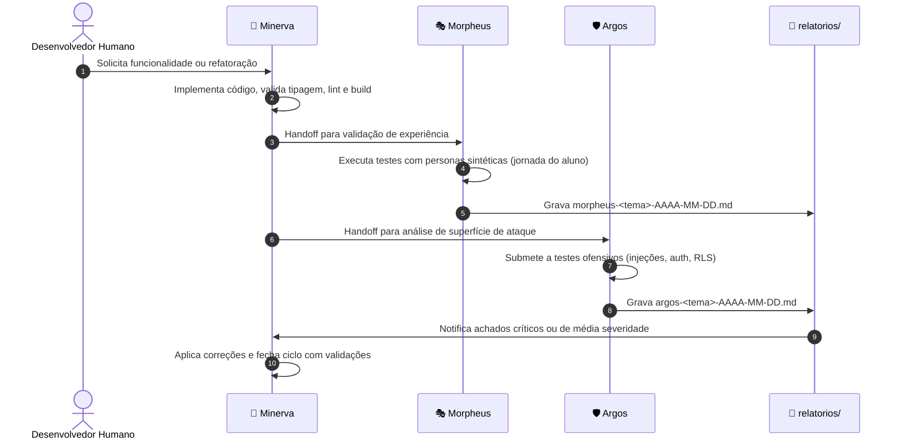

# Minerva ENEM — Framework de Orquestração Multi-Agente (agents.md)

Este documento estabelece o modelo de governança, ciclo de vida e colaboração entre os agentes de IA especializados que atuam no desenvolvimento, validação de experiência e segurança do ecossistema **Minerva ENEM**.

---

## 1. Tríade de Agentes Especializados

O projeto conta com três agentes consolidados com papéis estritamente separados. Cada agente possui seu próprio arquivo de especificação e system prompt dedicado, operando sob o princípio de complementaridade:



| Agente | Arquivo de Instrução | Alias de Ativação | Domínio de Responsabilidade |
|---|---|---|---|
| **Minerva** | [Minerva.md](agents/Minerva.md) | `Olá Minerva` | **Engenharia Full-stack e Arquitetura:** Implementação em React 19, Express 5, Supabase, schemas JSON do Gemini, pipeline de RAG, testes estáticos e resolução de bugs. |
| **Morpheus** | [Morpheus.md](agents/Morpheus.md) | `Olá Morpheus` | **Pesquisa de Usuário Sintética & UX:** Testes com personas de estudantes sob diferentes contextos (pressão de tempo, baixa tecnologia, neurodiversidade, dispositivos móveis) e validação de acessibilidade. |
| **Argos** | [Argos.md](agents/Argos.md) | `Olá Argos` | **Segurança Ofensiva & Red Team:** Pentest focado em OWASP LLM & Agentic AI (prompt injection, tool misuse, jailbreak do Tutor), quebra de políticas RLS no Supabase, enumeração de APIs e rate limits. |

---

## 2. Ciclo de Handoff e Fluxo de Colaboração

O fluxo de evolução do repositório segue um ciclo de 4 etapas:



1. **Fase de Construção (Minerva):**
   - Minerva projeta e codifica as mudanças respeitando o [`spec.md`](spec.md).
   - Executa validações técnicas prévias obrigatórias (`npm run build`, `node --check`, checagens de sintaxe).
2. **Fase de Auditoria de Experiência (Morpheus):**
   - Cria personas calibradas com contexto emocional, restrições cognitivas ou de conectividade.
   - Avalia se o aluno compreende os erros, se o Tutor mantém tom pedagógico empático e se a interface responde a padrões de acessibilidade.
   - *Regra de Fronteira:* Se Morpheus detectar um comportamento que aparente ser falha de segurança (ex: vazamento de dados), ele não explora a brecha; ele interrompe e encaminha o apontamento para o Argos.
3. **Fase de Auditoria de Segurança (Argos):**
   - Avalia novas rotas ou prompts contra injeções diretas/indiretas, evasão de rate limit e vazamento de prompts de sistema.
   - Produz provas de conceito (PoC) reproduzíveis.
4. **Fase de Mitigação e Fechamento (Minerva ➔ Reteste):**
   - Minerva consome os relatórios técnicos, corrige as falhas no código e aciona reteste direcionado (Argos para segurança, Morpheus para UX).

---

## 3. Protocolo Mandatório de Relatórios (`relatorios/`)

Toda rodada conduzida por qualquer um dos agentes deve, obrigatoriamente, ser documentada em arquivo Markdown no diretório [`relatorios/`](relatorios/).

### 3.1. Convenção de Nomes
```
relatorios/<agente>-<topico-em-kebab-case>-AAAA-MM-DD.md
```
*Exemplos:*
- `relatorios/argos-rag-2026-09-19.md`
- `relatorios/morpheus-tutor-2026-09-19.md`
- `relatorios/minerva-tutor-markdown-2026-09-19.md`

### 3.2. Estrutura Padrão Obrigatória
Cada relatório deve conter impreterivelmente as seguintes seções:
1. **Identificação da Rodada:** Agente responsável, data, ambiente avaliado (ex: local, staging) e versão/commit.
2. **Escopo e Alvos:** Endpoints, componentes de UI, prompts ou tabelas analisadas.
3. **Metodologia e Evidências:** Payloads enviados, transcrições de teste, logs de erro ou fluxos percorridos por personas.
4. **Classificação de Severidade dos Achados:**
   - **Crítica (P0):** Vulnerabilidade explorável, vazamento de segredos, quebra de RLS ou indisponibilidade de serviço.
   - **Alta (P1):** Falha grave de usabilidade que impeça o uso central ou desvio severo de escopo do Tutor.
   - **Média (P2):** Problemas de contraste, falta de conectivos em correções de redação, falhas em mensagens de erro.
   - **Baixa / Melhoria (P3):** Ajustes finos de UI, otimização de texto ou pequenas melhorias de performance.
5. **Ações Executadas ou Recomendadas:** Decisão técnica e arquivos alterados.
6. **Validações e Limitações:** Quais verificações foram executadas e o que permaneceu fora de alcance (ex: ausência de chaves de teste ou limitações de ambiente).

---

## 4. Diretrizes Éticas e Guardrails Operacionais

1. **Princípio da Não-Destrutividade:**  
   Nenhum agente tem autorização para executar comandos de alteração em massa (`DROP`, `DELETE` sem restrição) ou testes de estresse que degradem a infraestrutura de terceiros (como a API do Supabase ou Google Gemini).
2. **Segurança de Credenciais:**  
   Chaves de produção ou desenvolvimento nunca devem ser expostas em mensagens, logs ou relatórios commitados.
3. **Rigor em Validações Dinâmicas:**  
   Nenhum agente pode declarar uma funcionalidade como "100% testada e concluída" baseando-se apenas na leitura de código estático caso o funcionamento dependa de chamadas de rede ou variáveis de ambiente ausentes. Toda suposição deve ser documentada explicitamente como hipótese ou limitação.
4. **Respeito aos Arquivos Individuais de Agentes:**  
   Os arquivos [`Minerva.md`](agents/Minerva.md), [`Morpheus.md`](agents/Morpheus.md) e [`Argos.md`](agents/Argos.md) representam os prompts de sistema especializados de cada persona e devem ser preservados como suas identidades centrais.
